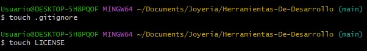
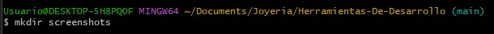
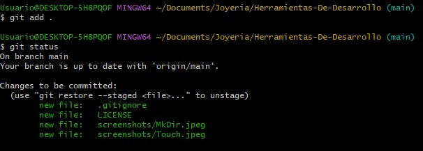
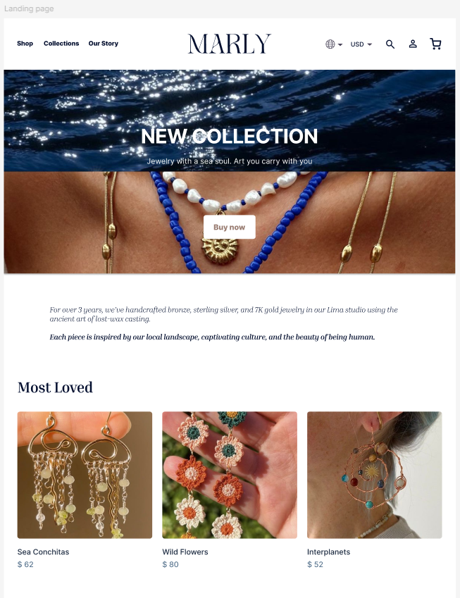
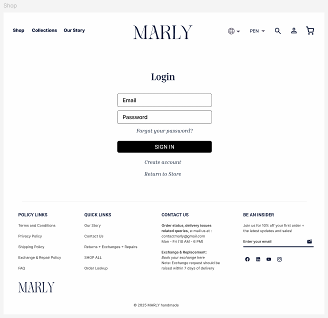
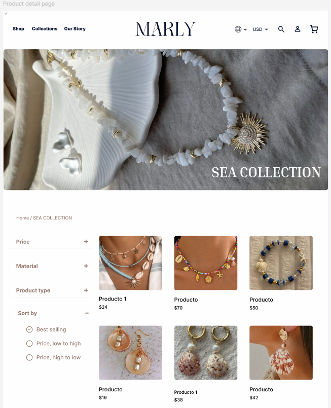
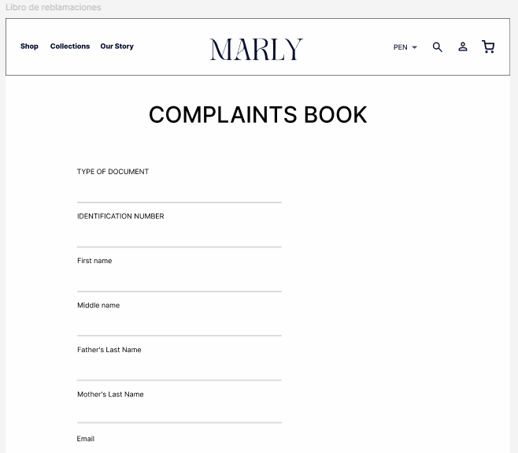
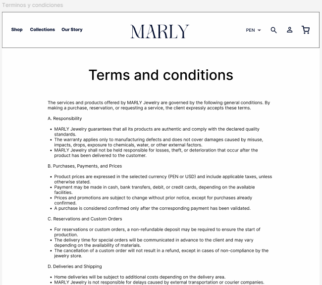

# 🛍️ Joyería Online - E-commerce  

Este proyecto consiste en el desarrollo de una **plataforma de comercio electrónico de joyería**, con funcionalidades de catálogo, carrito de compras, gestión de pedidos y administración de usuarios.  

---

## 🚀 Tecnologías utilizadas  

### Backend  
- **Spring Boot** (Java) – Framework principal para la lógica de negocio y APIs REST.  
- **IntelliJ IDEA** – IDE de desarrollo.  
- **MySQL** – Base de datos relacional para almacenamiento de información.  

### Frontend  
- **Vite + React** – Framework moderno para el desarrollo de la interfaz de usuario.  
- **CSS/Tailwind** – Estilos y diseño responsivo.  

### Despliegue  
- **AWS EC2** – Servidor de aplicación.  
- **AWS RDS** – Base de datos en la nube.  
- **AWS S3** – Almacenamiento de imágenes de productos.  

---

## 📦 Instalación y ejecución  

### Backend (Spring Boot)  
```bash
# Clonar repositorio
git clone https://github.com/nayy123/JoyeriaMarly-App.git

# Entrar al proyecto backend
cd backend

# Compilar y ejecutar
./mvnw spring-boot:run
```

### Frontend (React + Vite)
```bash
# Entrar al proyecto frontend
cd Joyeria_Marly_Frontend

# Instalar dependencias
npm install

# Ejecutar en entorno local
npm run dev
```

### Base de datos (MySQL)
- Crear una base de datos llamada joyeriaBD.
- Ejecutar el script SQL de creación de tablas (disponible en /db).
- Configurar credenciales en application.properties de Spring Boot.

```bash
spring.datasource.url=jdbc:mysql://localhost:3306/joyeriaBD
spring.datasource.username=root
spring.datasource.password=tu_password
spring.jpa.hibernate.ddl-auto=update
```

## 👥 Roles y Créditos
| Nombre | Rol | Funciones |
|--------|-----|-----------|
| Edson | Dev FullStack | Productos |
| Giancarlo | Dev FullStack | Login y Registro |
| Maryen | Git Master y Dev FullStack | Control de versiones |
| Nayeli | Dev FullStack | Reclamos |
| Anthony | Dev FullStack | Base de Datos |

## 👥 Roles del sistema  

### Cliente  
- Registrarse e iniciar sesión.  
- Visualizar catálogo de productos.  
- Agregar productos al carrito.  
- Ver y editar su información personal.  
- Realizar un reclamo
- Realizar una compra

### Administrador  
- Gestionar clientes (visualizar, editar, eliminar, buscar por DNI).  
- Gestionar productos (visualizar, agregar, modificar, eliminar, buscar por código).  
- Visualizar ventas realizadas y acceder a boletas.  
- Visualizar y editar productos.  
- Consultar pedidos por cliente (DNI o código de venta).   

---

## 📂 Arquitectura  

El proyecto sigue el **patrón de diseño MVC (Modelo - Vista - Controlador)**:  
- **Modelo**: Entidades como Producto, Pedido, Venta, Usuario, etc.  
- **Vista**: Interfaz desarrollada con React + Vite.  
- **Controlador**: Endpoints REST con Spring Boot.  

---

## 🗄️ Base de datos  

Se implementó en **MySQL**, con tablas principales como:  
- `Usuario`, `Roles`  , `Usuario_Rol`  
- `Producto`, `CategoriaProducto`, `Material`, `Coleccion`  
- `Pedido`, `DetallePedido`, `EstadoPedido`  
- `Venta`, `Boleta`

---

## 🔄 Flujo de Trabajo en Git
- Estructura de ramas: feature/, fix/
- Comandos en Git:
  ```bash
  git commit -m "feat: agregar funcionalidad para eliminar producto del carrito"
  touch .gitignore
  touch LICENSE
  git add .
  git switch
  git status
  git checkout -b "Rama"
  git commit --ammend -m "Mensaje"
  git log --oneline
  git reflog
  git branch "Rama"
  git merge "Rama"
  git push
  git pull
  git branch --no-merged
  git branch -d "Rama"
  mkdir "NombreCarpeta"
---

### 🖼️ Capturas de Pantalla








### 🏠 Pantalla Principal

---

### Pagina Login

---

### 🛍️ Lista de Productos

---

### Página de Nosotros

---

### Página de Reclamos/Términos y condiciones


---