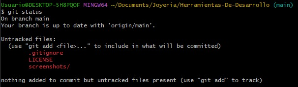

# 🛍️ Joyería Online - E-commerce

Este proyecto consiste en el desarrollo de una _plataforma de comercio electrónico de joyería_, con funcionalidades de catálogo, carrito de compras, gestión de pedidos y administración de usuarios.

---

## 🚀 Tecnologías utilizadas

### Backend

- _Spring Boot_ (Java) – Framework principal para la lógica de negocio y APIs REST.
- _IntelliJ IDEA_ – IDE de desarrollo.
- _MySQL_ – Base de datos relacional para almacenamiento de información.

### Frontend

- _Vite + React_ – Framework moderno para el desarrollo de la interfaz de usuario.
- _CSS/Tailwind_ – Estilos y diseño responsivo.

### Despliegue

- _AWS EC2_ – Servidor de aplicación.
- _AWS RDS_ – Base de datos en la nube.
- _AWS S3_ – Almacenamiento de imágenes de productos.

---

## 📦 Instalación y ejecución

### Backend (Spring Boot)

bash

# Clonar repositorio

git clone https://github.com/nayy123/JoyeriaMarly-App.git

# Entrar al proyecto backend

cd backend

# Compilar y ejecutar

./mvnw spring-boot:run

### Frontend (React + Vite)

bash

# Entrar al proyecto frontend

cd Joyeria_Marly_Frontend

# Instalar dependencias

npm install

# Ejecutar en entorno local

npm run dev

### Base de datos (MySQL)

- Crear una base de datos llamada joyeriaBD.
- Ejecutar el script SQL de creación de tablas (disponible en /db).
- Configurar credenciales en application.properties de Spring Boot.

bash
spring.datasource.url=jdbc:mysql://localhost:3306/joyeriaBD
spring.datasource.username=root
spring.datasource.password=tu_password
spring.jpa.hibernate.ddl-auto=update

## 👥 Roles y Créditos

| Nombre    | Rol                        | Funciones            |
| --------- | -------------------------- | -------------------- |
| Edson     | Dev FullStack              | Productos            |
| Giancarlo | Dev FullStack              | Login y Registro     |
| Maryen    | Git Master y Dev FullStack | Control de versiones |
| Nayeli    | Dev FullStack              | Reclamos             |
| Anthony   | Dev FullStack              | Base de Datos        |

## 👥 Roles del sistema

### Cliente

- Registrarse e iniciar sesión.
- Visualizar catálogo de productos.
- Agregar productos al carrito.
- Ver y editar su información personal.
- Realizar un reclamo
- Realizar una compra

### Administrador

- Gestionar clientes (visualizar, editar, eliminar, buscar por DNI).
- Gestionar productos (visualizar, agregar, modificar, eliminar, buscar por código).
- Visualizar ventas realizadas y acceder a boletas.
- Visualizar y editar productos.
- Consultar pedidos por cliente (DNI o código de venta).

---

## 📂 Arquitectura

El proyecto sigue el _patrón de diseño MVC (Modelo - Vista - Controlador)_:

- _Modelo_: Entidades como Producto, Pedido, Venta, Usuario, etc.
- _Vista_: Interfaz desarrollada con React + Vite.
- _Controlador_: Endpoints REST con Spring Boot.

---

## 🗄️ Base de datos

Se implementó en _MySQL_, con tablas principales como:

- Usuario, Roles , Usuario_Rol
- Producto, CategoriaProducto, Material, Coleccion
- Pedido, DetallePedido, EstadoPedido
- Venta, Boleta

---

## 🔄 Flujo de Trabajo en Git

- Estructura de ramas: feature/, fix/
- Comandos en Git:
  ```bash
  git commit -m "feat: agregar funcionalidad para eliminar producto del carrito"
  touch .gitignore
  touch LICENSE
  git add .
  git switch
  git status
  git checkout -b "Rama"
  git commit --ammend -m "Mensaje"
  git log --oneline
  git reflog
  git branch "Rama"
  git merge "Rama"
  git push
  git pull
  git branch --no-merged
  git branch -d "Rama"
  mkdir "NombreCarpeta"
  ```

---

### 🖼️ Capturas de Pantalla




### 🏠 Página Principal

---


### 🛍️ Lista de Productos

---

### 🛒 Carrito de Compras

---
